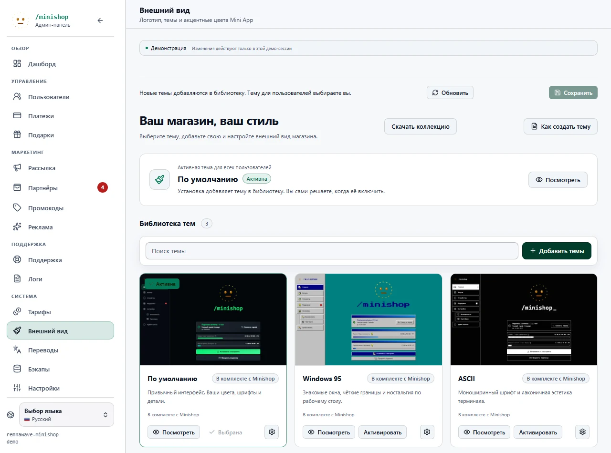

> **Обновление темы по умолчанию.** Встроенная `dark` теперь является канонической темой по умолчанию и содержит
> два варианта: `dark` и `light`. Старый ключ `light` сохранён как скрытый
> alias совместимости, поэтому существующие ссылки `WEBAPP_DEFAULT_THEME=light` и `/home?theme_preview=light`
> по-прежнему открывают светлый вариант, но админы настраивают его через единую карточку Default theme.
> Карточка поддерживает удобную no-code настройку: пресеты, переключатель dark/light, токены палитры,
> радиус, масштаб логотипа для десктопа/мобильного, отдельную палитру админки и выпадающие списки шрифтов для UI,
> бренда и моноширинного текста.

# Темы и внешний вид Web App

Web App поддерживает файловые темы, предпросмотр и базовую настройку внешнего вида из админ-панели. Тема может быть простой цветовой схемой на JSON-токенах или полноценным скином с собственным CSS, шрифтами, иконками и графикой.


## Установка из админки

В **Внешнем виде** сначала показаны активная тема и библиотека. Настройка Default,
поведение интерфейса и бренд находятся в сворачиваемых разделах. Карточки встроенных тем
показывают настоящую главную страницу ЛК с демонстрационными данными.

1. Сохраните незавершённые изменения внешнего вида.
2. Нажмите **Добавить темы**. Перетащите один ZIP в окно или выберите его кнопкой.
   Вместо архива можно вставить ссылку на публичный GitHub/GitLab-репозиторий.
3. Проверьте список найденных тем, версии и сообщения о несовместимости. При необходимости
   откройте предпросмотр. В коллекции можно выбрать несколько тем.
4. Для совпадающих ключей выберите **Пропустить** или **Обновить и сохранить настройки**.
   Встроенные темы защищены от замены. Существующая тема, загруженная по SFTP, требует
   отдельного согласия на передачу под управление библиотеки.
5. Подтвердите установку. Все выбранные темы публикуются одним изменением каталога.
6. Откройте установленную тему в предпросмотре и нажмите **Активировать**, когда она готова.

Установка сама по себе не меняет тему пользователей и не включает CSS в админке.
Настройки Default можно развернуть и изменить в любой момент. Перед другими действиями
с каталогом сохраните изменения кнопкой **Сохранить**.

Для Git можно указать ветку, тег, коммит и подпапку. Поддерживаются также ссылки на страницу
`tree`. Репозиторий скачивается как снимок конкретного коммита; сборка и скрипты не запускаются.
Закрытые репозитории и самостоятельно размещённые Git-серверы пока не поддерживаются.

Лимиты ZIP: 20 МиБ, 100 МиБ распакованных данных, 2000 файлов, 20 тем.
Подробный формат, готовые примеры и инструкции сборки: [Создание и публикация тем](theme-packages.md).

## Обновление, откат и экспорт

В настройках карточки доступны **Проверить обновления** для темы из репозитория,
**Вернуть предыдущую версию**, **Экспорт / своя копия** и удаление управляемой темы.
Обновление через ZIP проходит тот же просмотр и выбор конфликтов.

Файлы автора и настройки владельца хранятся раздельно. Обновление меняет пакет, сохраняя
вашу палитру, шрифты, масштаб логотипа и выбор активной темы. Если новый пакет удалил
вариант, для которого есть ваши настройки, обновление отклоняется. Сохраняется до пяти
предыдущих версий. Откат также сохраняет настройки владельца.

Экспорт по умолчанию отдаёт пакет автора. Флажок **Включить мои цвета и настройки** создаёт
архив с вашими изменениями. Новый уникальный ключ превращает экспорт в самостоятельную
тему, которую можно устанавливать рядом с оригиналом. **Скачать коллекцию** экспортирует
всю видимую библиотеку; встроенные ключи в ней нужно переименовать перед импортом в другой
экземпляр, если вы хотите получить изменяемые копии.

Активную тему удалить нельзя: сначала выберите другую для пользователей и отключите
использование удаляемой темы в админке. Исходная папка принятой под управление SFTP-темы
сохраняется как локальная копия и скрывается из каталога при удалении. Изменения этой папки
на сервере обнаруживаются; библиотека не перезаписывает их автоматически.

Если каталог изменили в другой вкладке, устаревшее действие отклоняется. Обновите страницу
и повторно проверьте выбранные темы. Повтор одного и того же подтверждения установки
не устанавливает пакет второй раз.

## Хранение и резервные копии

Папка `WEBAPP_THEMES_DIR` должна находиться на постоянном томе с правами записи для backend.
Ручные темы в `<key>/theme.json` продолжают поддерживаться. Управляемые темы используют:

```text
data/themes/
  dark/                    # встроенные и ручные темы
  _packages/<sha256>/       # неизменяемые версии пакетов
  _registry/current.json   # каталог, настройки владельца и история
  _imports/<operation>/    # временная проверка перед установкой
```

Не редактируйте `_packages` и `_registry` вручную. Обновляйте тему через библиотеку.
Каталог публикуется атомарной заменой индекса; конкурентные операции координируются
блокировкой общего тома. Все процессы должны использовать один и тот же постоянный каталог.

Импорт принадлежит создавшему его администратору и действует 30 минут. Одновременно допускается
до четырёх импортов. Общий лимит управляемого хранилища — 1 ГиБ. При новых импортах удаляются
истёкшие временные каталоги и больше не используемые версии после семидневного периода хранения.
Ссылки на старые ресурсы остаются доступны в течение этого периода для уже открытых страниц.

Автоматические и ручные резервные копии включают темы, версии и настройки владельца в
`config/themes/`. Временные импорты не включаются. Восстановление базы из новой резервной
копии также восстанавливает темы; архив без раздела тем сохраняет текущие темы.
Перед публикацией восстановленного каталога проверяются хеши и формат управляемых пакетов.
Локальная страховочная копия создаётся в `data/themes/_restore/`.
Восстановление выполняется в существующем режиме обслуживания.

Для временного восстановления стандартного оформления используйте существующий override
`WEBAPP_DEFAULT_THEME=dark` и перезапустите приложение; затем исправьте или откатите пользовательскую
тему. Не удаляйте каталог тем вместе с резервной копией.


## Что можно поменять

Через раздел **Админка -> Внешний вид** можно:

- выбрать глобальную тему Web App;
- включить или выключить пользовательский выбор режима темы;
- изменить accent-цвет конкретной темы;
- включить или выключить применение темы в админ-панели;
- настроить масштаб логотипа на главной и экране входа;
- загрузить логотип файлом или по HTTPS-ссылке;
- открыть предпросмотр темы через `/home?theme_preview=<key>`.

## Выбор режима пользователем

В **Настройках** Mini App отображается обычный выпадающий список «Режим темы»: `Авто`, `Светлый`
и `Тёмный`. Пользователь не выбирает тему из каталога — тема по-прежнему задаётся администратором
через `default_theme`. Список меняет только вариант `light` / `dark` внутри этой текущей темы.

Предпочтение хранится только на клиенте: внутри Telegram — в CloudStorage (Bot API 6.9+), поэтому
оно переезжает между устройствами пользователя, в браузере — в `localStorage`. На сервер значение
не отправляется. `Авто` следует режиму Telegram внутри Mini App или `prefers-color-scheme` в
браузере; если клиент режим не сообщает, остаётся вариант, выбранный администратором.

Переключатель показывается, когда текущая тема объявляет оба варианта: `variants.light` и
`variants.dark`, а администратор не отключил настройку **Выбор режима темы пользователем** в
**Админка -> Внешний вид**. Флаг `WEBAPP_USER_THEME_MODE_ENABLED` включён по умолчанию. Когда он
выключен, строка выбора скрывается, а сохранённое на клиенте предпочтение не применяется: остаётся
вариант, выбранный администратором. Все встроенные темы (`Default`, `Windows 95`, `ASCII`) поддерживают оба режима.
Скрытый ключ `light` остаётся только совместимым alias для старых настроек и не появляется в
пользовательском списке.

Через файлы темы можно менять намного больше:

- базовые цвета Mini App и админки;
- радиусы, семейства шрифтов и размер главного логотипа;
- любые компоненты через CSS: карточки, навигацию, таблицы, модалки, кнопки, скелетоны, прогресс-бары, состояния hover/active и мобильную/desktop-верстку;
- экран инструкций установки (`/install` и `/s/<token>`): topbar, выбор платформы, карточки приложений, шаги инструкции и QR-блок личной страницы;
- иконки и изображения, если CSS ссылается на ассеты темы;
- стили только пользовательской части, только админки или обеих частей сразу.

Готовые темы лежат в `backend/bot/app/web/themes`: `dark` (показывается как `Default`), `windows95`, `ascii`. У каждой есть варианты `light` и `dark`; ключ `light` оставлен только как скрытый алиас для старых настроек. При первом запуске темы копируются в `WEBAPP_THEMES_DIR`, по умолчанию `data/themes`.

## Где живут темы

Каждая тема - отдельная папка:

```text
data/themes/
  neon/
    theme.json
    style.css
    icons/
      save.png
```

Путь настраивается переменной:

```env
WEBAPP_THEMES_DIR=data/themes
WEBAPP_DEFAULT_THEME=
```

`WEBAPP_DEFAULT_THEME` опционален. Если он задан и совпадает с ключом темы, он переопределяет `default: true` в `theme.json`. Если переменная пустая, дефолт выбирается из дескрипторов тем.

В compose-примерах `data/themes` - это локальная папка рядом с выбранным `docker-compose.yml`; она монтируется в контейнер как `/app/data/themes`. Правки в `backend/bot/app/web/themes` попадают в прод только при сборке собственного образа; опубликованный образ их не видит.

Важно: `WEBAPP_PRIMARY_COLOR` и `WEBAPP_LOGO_URL` больше не являются рабочим способом первичной настройки через `.env`. Эти значения редактируются в админке и сохраняются как overrides в базе. Тема при этом может использовать сохраненный primary color как fallback accent.

Email-шаблоны берут тот же бренд из настроек внешнего вида. Загруженный логотип добавляется в письма как inline image (`cid:webapp-logo`), а публичный HTTPS-логотип остается внешней картинкой, которую почтовый клиент может скрыть до разрешения загрузки изображений.

## Контракт `theme.json`

Минимальная тема:

```json
{
  "key": "neon",
  "names": {
    "ru": "Неон",
    "en": "Neon"
  },
  "enabled": true,
  "default": true,
  "use_primary_accent": true,
  "use_in_admin": true,
  "active_variant": "dark",
  "variants": {
    "dark": {
      "color_scheme": "dark",
      "bg": "#05040a",
      "panel": "#11101c",
      "text": "#f8f7ff"
    },
    "light": {
      "color_scheme": "light",
      "bg": "#faf8ff",
      "panel": "#ffffff",
      "text": "#211a2e"
    }
  },
  "tokens": {
    "color_scheme": "dark",
    "bg": "#05040a",
    "panel": "#11101c",
    "text": "#f8f7ff",
    "muted": "#b8b2d8",
    "accent": "#a855f7",
    "radius": "14px"
  }
}
```

Тема с CSS:

```json
{
  "key": "neon",
  "names": {
    "ru": "Неон",
    "en": "Neon"
  },
  "enabled": true,
  "default": false,
  "use_primary_accent": false,
  "use_in_admin": true,
  "css_file": "style.css",
  "assets_version": 1,
  "tokens": {
    "color_scheme": "dark",
    "style_preset": "none",
    "accent": "#a855f7",
    "bg": "#05040a",
    "panel": "#11101c",
    "panel_2": "#090815",
    "panel_3": "#1a1830",
    "border": "rgba(168, 85, 247, 0.28)",
    "border_strong": "rgba(168, 85, 247, 0.48)",
    "text": "#f8f7ff",
    "muted": "#b8b2d8",
    "dim": "#756f9b",
    "danger": "#ff6b8a",
    "blue": "#38bdf8",
    "radius": "14px",
    "font_sans": "Inter, system-ui, sans-serif",
    "font_logo": "Inter, system-ui, sans-serif",
    "font_mono": "\"JetBrains Mono\", \"Fira Code\", monospace",
    "home_logo_scale_desktop": 120,
    "home_logo_scale_mobile": 95,
    "admin_bg": "#05040a",
    "admin_surface": "#11101c",
    "admin_surface_2": "#090815",
    "admin_elev": "#1a1830",
    "admin_border": "rgba(168, 85, 247, 0.28)",
    "admin_border_strong": "rgba(168, 85, 247, 0.48)",
    "admin_text": "#f8f7ff",
    "admin_muted": "#b8b2d8",
    "admin_dim": "#756f9b"
  }
}
```

Поля верхнего уровня:

| Поле                 | Назначение                                                                                              |
| -------------------- | ------------------------------------------------------------------------------------------------------- |
| `key`                | Уникальный ключ темы, 1-64 символа: латиница, цифры, `_` и `-`. Если ключ не указан, берется имя папки. |
| `names`              | Локализованные названия, например `ru` и `en`.                                                          |
| `enabled`            | Показывать тему пользователям. Отключенная тема не попадает в публичный каталог.                        |
| `default`            | Делает тему выбранной по умолчанию, если `WEBAPP_DEFAULT_THEME` не задан.                               |
| `use_primary_accent` | Если `true`, тема может получить accent из настройки внешнего вида, когда в `tokens.accent` ничего нет. |
| `use_in_admin`       | Если `false`, пользовательская часть использует тему, но админка откатывается на `dark`.                |
| `css_file`           | CSS-файл внутри папки темы. Может быть `style.css` или вложенный путь вроде `css/theme.css`.            |
| `assets_version`     | Версия ассетов. Для встроенных тем используется для обновления старых файлов в `data/themes`.           |
| `active_variant`     | Режим темы по умолчанию: `light` или `dark`.                                                            |
| `variants`           | Палитры `light` и `dark`, между которыми переключается пользователь.                                    |
| `tokens`             | Общие дизайн-токены; активный вариант накладывается поверх них и превращается в CSS-переменные.         |

## Токены

Поддерживаемые токены:

| Токен                     | CSS-переменная              | Что меняет                                                                                                 |
| ------------------------- | --------------------------- | ---------------------------------------------------------------------------------------------------------- |
| `color_scheme`            | `color-scheme`              | Нативная светлая/темная схема браузера: `dark` или `light`.                                                |
| `style_preset`            | CSS-класс пресета           | Сейчас `win95`/`windows95` добавляет `theme-preset-win95`; остальные значения не дают специального класса. |
| `accent`                  | `--accent`                  | Главный акцент: активные элементы, кнопки, прогресс, фокус. Только hex `#RGB` или `#RRGGBB`.               |
| `bg`                      | `--bg`                      | Основной фон приложения.                                                                                   |
| `panel`                   | `--panel`                   | Основные карточки и поверхности.                                                                           |
| `panel_2`                 | `--panel-2`                 | Вторичные поверхности.                                                                                     |
| `panel_3`                 | `--panel-3`                 | Поверхности повышенной вложенности, dropdown/popover.                                                      |
| `border`                  | `--border`                  | Обычные границы.                                                                                           |
| `border_strong`           | `--border-strong`           | Усиленные границы и hover-состояния.                                                                       |
| `text`                    | `--text`                    | Основной текст.                                                                                            |
| `muted`                   | `--muted`                   | Вторичный текст.                                                                                           |
| `dim`                     | `--dim`                     | Еще более тихий текст и служебные подписи.                                                                 |
| `danger`                  | `--danger`                  | Ошибки и опасные действия.                                                                                 |
| `blue`                    | `--blue`                    | Синий вспомогательный цвет.                                                                                |
| `radius`                  | `--radius`                  | Базовый радиус карточек, кнопок и контролов.                                                               |
| `font_sans`               | `--font-sans`               | Основной шрифт интерфейса.                                                                                 |
| `font_logo`               | `--font-logo`               | Шрифт бренда и заголовка.                                                                                  |
| `font_mono`               | `--font-mono`               | Моноширинный шрифт.                                                                                        |
| `home_logo_scale_desktop` | `--home-logo-scale-desktop` | Масштаб логотипа на desktop layout, от `50` до `300` процентов.                                            |
| `home_logo_scale_mobile`  | `--home-logo-scale-mobile`  | Масштаб логотипа на mobile layout, от `50` до `300` процентов.                                             |
| `home_logo_scale`         | `--home-logo-scale`         | Legacy fallback для старых тем; используется, если desktop/mobile token не задан.                          |
| `home_subscription_period_visibility` | поведение компонента | Видимость периода подписки на главной. |
| `home_tariff_name_visibility` | поведение компонента | Видимость названия текущего тарифа на главной. |
| `home_subscription_end_visibility` | поведение компонента | Видимость даты окончания подписки на главной. |
| `home_regular_traffic_visibility` | поведение компонента | Видимость блока обычного трафика на главной. |
| `home_premium_traffic_visibility` | поведение компонента | Видимость блока премиум-трафика на главной. |
| `home_change_tariff_visibility` | поведение компонента | Видимость действия смены тарифа на главной. |
| `home_balance_visibility` | поведение компонента | Видимость баланса на главной. |
| `home_auto_renew_visibility` | поведение компонента | Видимость управления автопродлением на главной. |
| `admin_bg`                | `--admin-bg`                | Фон админ-панели.                                                                                          |
| `admin_surface`           | `--admin-surface`           | Основные карточки админки.                                                                                 |
| `admin_surface_2`         | `--admin-surface-2`         | Вторичные поверхности админки.                                                                             |
| `admin_elev`              | `--admin-elev`              | Elevated-поверхности админки.                                                                              |
| `admin_border`            | `--admin-border`            | Границы админки.                                                                                           |
| `admin_border_strong`     | `--admin-border-strong`     | Усиленные границы админки.                                                                                 |
| `admin_text`              | `--admin-text`              | Основной текст админки.                                                                                    |
| `admin_muted`             | `--admin-muted`             | Вторичный текст админки.                                                                                   |
| `admin_dim`               | `--admin-dim`               | Тихие подписи админки.                                                                                     |
| `separator`               | `--separator`               | Разделитель частей метаданных в пользовательской части. По умолчанию `·`, пустая строка убирает его.       |
| `referral_bonus_list`     | поведение компонента        | Список бонусов за приглашения: `plain` (обычные строки), `collapsed` (сворачиваемый, закрыт) или `expanded` (сворачиваемый, раскрыт). |

`--font-sans` хранит выбранный темой основной шрифт. Общие стили централизованно собирают
итоговый стек `--font-ui` из встроенного шрифта флагов и `--font-sans`; поэтому CSS темы и
компонентов должен использовать `var(--font-ui)` для обычного текста и не дублировать стек флагов.

Разделители-точки в пользовательской части рисуются из `--separator`: карточка устройства,
метакарточка тикета, сводка на главной, статус сервера, подарки и дни чекаута берут символ
только из этого токена. Отдельный разделитель ставится пустым элементом
`<span class="meta-separator" aria-hidden="true"></span>`; рядом стоящие пробелы остаются
обычным текстом, поэтому отступы не меняются. Значение - короткая строка до 8 символов; оно
попадает в CSS как строка, поэтому `content: var(--separator)` всегда валиден. Токен
`separator: ""` или `--separator: ""` в CSS темы убирает разделитель целиком, и литерал `·` в
разметке этих мест больше не нужен.

Токен `referral_bonus_list` управляет представлением списка бонусов за приглашения в разделе
«Бонусы». Это осознанное исключение из правила «тема меняет вид, а не поведение»: CSS не может
добавить сворачивание, поэтому тема выбирает режим токеном, а экран применяет его. `plain`
оставляет строки как есть, `collapsed` прячет периоды оплаты в сворачиваемый блок, `expanded`
раскрывает этот блок по умолчанию (заодно раскрываются группировки по тарифам). Нераспознанное
значение игнорируется, и список остается в режиме `plain`.

Все токены `home_*_visibility` используют один универсальный набор значений:

- `auto` или отсутствующий токен сохраняет стандартные продуктовые правила;
- `hidden` полностью убирает элемент из обычного представления;
- `visible` показывает элемент, когда для него есть данные или доступное действие, даже если
  стандартная эвристика скрыла бы его. Например, название единственного тарифа и нулевой баланс
  можно показать явно.

Эти режимы применяются одинаково к обычной и компактной главной странице. Они не создают
недоступные backend-действия и не скрывают предупреждение об истекающей или уже истёкшей
подписке: аварийный статус, срок и дата остаются видимыми. Нераспознанное значение безопасно
переходит в `auto`. В админке все восемь элементов редактируются одним набором селекторов в
карточке темы; настройки могут различаться между её светлым и тёмным вариантами.

Если `css_file` не задан, интерфейс полностью строится на токенах и общих стилях. Если `css_file` задан, токены все равно применяются первыми, а CSS темы может уточнить или полностью переопределить внешний вид.

## CSS-слой темы

CSS темы подключается как:

```text
/webapp-theme-css/<key>/<css_file>
```

Например `data/themes/neon/style.css` будет доступен как `/webapp-theme-css/neon/style.css`.

Корневой контейнер получает классы:

```text
app-shell theme-dark theme-key-neon theme-css-style
```

Для светлой схемы будет `theme-light`. Класс `theme-key-<key>` - основной якорь для CSS темы. Всегда начинайте селекторы с него, чтобы тема не задевала другие режимы:

```css
.theme-key-neon.app-shell {
  --surface-sheen: rgba(168, 85, 247, 0.12);
  --shadow-soft: 0 18px 48px rgba(12, 5, 30, 0.44);
}

.theme-key-neon .card {
  border-color: color-mix(in srgb, var(--accent) 34%, var(--border));
  background:
    linear-gradient(135deg, rgba(168, 85, 247, 0.14), rgba(56, 189, 248, 0.05)),
    var(--panel);
}

.theme-key-neon .bottom-nav button.active,
.theme-key-neon .admin-nav-item.active {
  box-shadow: 0 0 18px color-mix(in srgb, var(--accent) 24%, transparent);
}
```

CSS можно писать для пользовательской части и админки одновременно:

```css
.theme-key-neon .period-card,
.theme-key-neon .method-card,
.theme-key-neon .option-row {
  border-radius: 16px;
}

.theme-key-neon .admin-card,
.theme-key-neon .admin-stat-card,
.theme-key-neon .admin-revenue-panel {
  border-radius: 16px;
}
```

Часть поверхностей рендерится вне `.app-shell`: тосты (`.app-toast`), выпадающие списки
(`.language-select-content`, `.admin-select-content`, `.install-platform-content`), тултипы полей.
Селектор `.theme-key-<key> .app-toast` до них не достанет, потому что элемент лежит рядом с шеллом,
а не внутри него. Для таких элементов начинайте селектор с `body:has(...)` и задавайте цвета
явно - токены темы туда тоже не наследуются:

```css
body:has(.theme-key-neon) .app-toast {
  border: 1px solid #a855f7;
  background: #11101c;
  color: #f8f7ff;
}
```

Ограничения:

- CSS-файл должен быть внутри папки темы;
- размер CSS - до 512 KiB;
- путь не может содержать `..`;
- удаленные CSS, `data:` и protocol-relative URL в `css_file` не подключаются.

## Ассеты темы

Картинки темы кладутся рядом с `theme.json` и отдаются через:

```text
/webapp-theme-assets/<key>/<path>
```

Пример:

```css
.theme-key-neon .btn-primary::before {
  content: "";
  width: 16px;
  height: 16px;
  background: url("/webapp-theme-assets/neon/icons/spark.png") center / contain
    no-repeat;
}
```

При импорте разрешены `png`, `jpg`, `jpeg`, `gif`, `webp`, проверенные `svg`, `ico` и локальные `woff`, `woff2`, `ttf`, `otf`. Один ресурс — до 10 МиБ. SVG проходит серверную проверку: активная разметка, обработчики событий, встроенные документы, внешние и `data:`-адреса отклоняются. Для распространяемого пакета используйте относительные ссылки на локальные ресурсы; внешние `@import` и URL отклоняются.

## Ручная установка темы для разработки

Для публикации архивов и репозиториев используйте [новый формат пакета и CLI](theme-packages.md).
Шаги ниже относятся к доверенным локальным файлам на собственном тестовом сервере.

1. Выберите ключ темы.

   Ключ должен быть стабильным: по нему сохраняется выбранная тема и строятся URL ассетов. Используйте короткий slug: `neon`, `brand_dark`, `terminal-blue`. Не переименовывайте ключ после публикации без миграции файлов и сохраненных настроек.

2. Создайте папку в `WEBAPP_THEMES_DIR`.

   В Docker это `data/themes` рядом с выбранным `docker-compose.yml`, внутри контейнера путь будет `/app/data/themes`. Убедитесь, что контейнер может писать в `data`.

   ```bash
   mkdir -p data/themes/neon
   ```

3. Скопируйте ближайшую базовую тему.

   Для обычной брендовой темы чаще всего удобнее начать с `dark` и при необходимости переключить/настроить его светлый variant. Для глубокого CSS-скина можно взять `ascii` или `windows95` как пример того, насколько далеко можно уйти от стандартного вида.

   ```bash
   cp backend/bot/app/web/themes/dark/theme.json data/themes/neon/theme.json
   ```

4. Отредактируйте `theme.json`.

   Сначала поменяйте `key`, `names`, `default`, `use_primary_accent` и базовые токены. На этом этапе можно вообще не создавать CSS: приложение уже увидит тему как новый набор токенов.

5. Запустите приложение и откройте админку.

   Раздел **Внешний вид** загружает `/api/admin/themes`, backend читает `WEBAPP_THEMES_DIR`, добавляет обязательные базовые темы и возвращает каталог. Нажмите **Обновить**, если папка была создана во время работы приложения.

6. Проверьте тему через предпросмотр.

   В карточке темы нажмите **Предпросмотр** или откройте:

   ```text
   https://app.domain.com/home?theme_preview=neon
   ```

   Предпросмотр не меняет глобальную тему и удобен для проверки CSS до публикации.

7. Подберите accent, масштаб логотипа и элементы главной страницы.

   В админке можно менять accent, `home_logo_scale_desktop`, `home_logo_scale_mobile` и режимы `home_*_visibility` без ручного редактирования JSON. При сохранении backend перепишет `theme.json` в `WEBAPP_THEMES_DIR`, выставит ровно один `default` и сбросит кеш публичных настроек. Старый `home_logo_scale` сохраняется как fallback для уже существующих тем.

8. Добавьте `style.css`, если токенов мало.

   Создайте файл, укажите его в `theme.json`:

   ```json
   {
     "css_file": "style.css"
   }
   ```

   Начинайте с переопределения CSS-переменных на `.theme-key-neon.app-shell`, затем переходите к конкретным компонентам. Проверяйте минимум: главная, `/install`, публичная `/s/<token>`, оплата, настройки, модалки, админский дашборд, таблица пользователей, редактор тарифов.

   После ручного изменения CSS поднимите `assets_version` в `theme.json` или сделайте жесткую перезагрузку страницы: тема подключается с `?v=<assets_version>`, и браузер может держать старую версию.

9. Добавьте ассеты при необходимости.

   Положите картинки в подпапку темы и ссылайтесь на них через `/webapp-theme-assets/<key>/...`. Не используйте относительные пути вроде `url("icons/x.png")`, если CSS может быть подключен с другого URL-уровня; явный `/webapp-theme-assets/neon/icons/x.png` надежнее.

10. Настройте поведение админки.

    Если тема сильно декоративная и мешает рабочей админке, выставьте `use_in_admin: false`. Пользователи увидят тему, а администраторы в разделе админки получат `dark` как fallback.

11. Сделайте тему дефолтной.

    Есть два способа:
    - в админке выбрать тему и сохранить;
    - указать `WEBAPP_DEFAULT_THEME=neon` в `.env`, если нужен жесткий override на уровне окружения.

12. Зафиксируйте тему.

    Для темы, которая должна ехать вместе с проектом, добавьте ее в репозиторий в `backend/bot/app/web/themes` и при необходимости расширьте `DEFAULT_THEME_KEYS` в `backend/config/webapp_themes_config.py`. Для приватной инсталляции достаточно хранить ее в `data/themes`.

## Насколько глубоко можно менять вид

Уровни кастомизации:

1. **Быстрый бренд** - токены `accent`, `bg`, `panel`, `text`, `radius`, логотип в админке. Код не нужен.
2. **Полная палитра** - все пользовательские и admin-токены, отдельные шрифты, масштаб логотипа.
3. **CSS-скин** - переопределение карточек, навигации, таблиц, модалок, progress/skeleton/toast, desktop/mobile раскладок.
4. **Почти новый UI** - тема вроде `windows95` или `ascii`: можно менять форму контролов, иконки, эффекты, таблицы и визуальный язык целиком, пока сохраняется DOM и интерактивные состояния.

Не стоит менять через CSS смысловые состояния: скрывать ошибки, отключать фокус, перекрывать кнопки невидимыми слоями или делать `display: none` для обязательных действий оплаты и авторизации. Тема должна менять внешний вид, а не бизнес-логику.

## Диагностика

Если тема не появилась:

- проверьте, что `theme.json` лежит ровно в `WEBAPP_THEMES_DIR/<key>/theme.json`;
- ключ состоит только из латиницы, цифр, `_` и `-`;
- JSON валиден;
- тема не отключена через `enabled: false`;
- в логах нет предупреждения `Ignoring theme descriptor`.

Если CSS не применился:

- проверьте `css_file` и URL `/webapp-theme-css/<key>/<css_file>`;
- если CSS уже был открыт в браузере, увеличьте `assets_version` в `theme.json` или очистите кеш;
- убедитесь, что файл не больше 1 МиБ;
- начинайте селекторы с `.theme-key-<key>`;
- откройте `/home?theme_preview=<key>` в новом окне, чтобы исключить сохраненный старый выбор.

Если ассеты не грузятся:

- используйте путь `/webapp-theme-assets/<key>/<path>`;
- проверьте расширение: `png`, `jpg`, `jpeg`, `gif`, `webp`, `svg`, `ico`;
- размер каждого файла должен быть до 1 MiB;
- путь не должен содержать пробелы, кириллицу или `..`.
